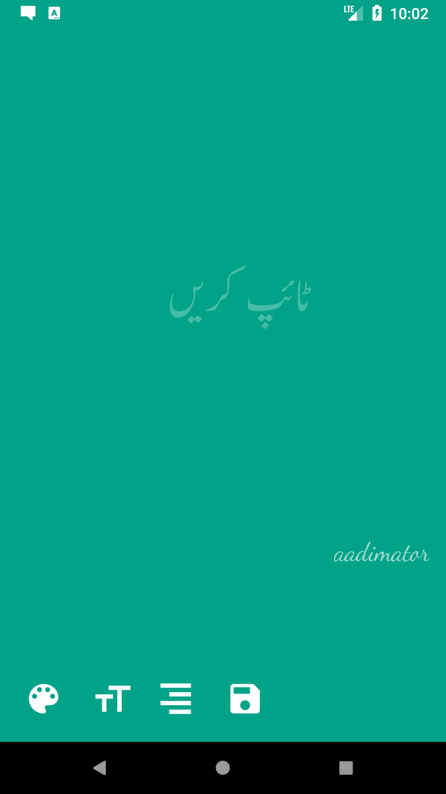
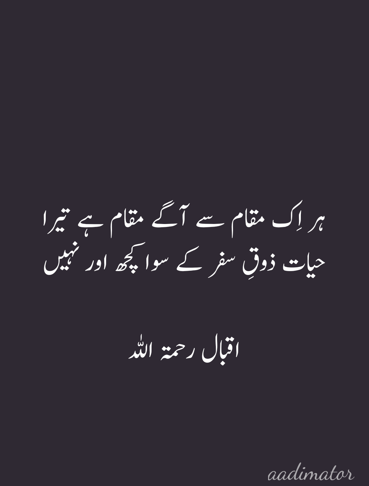
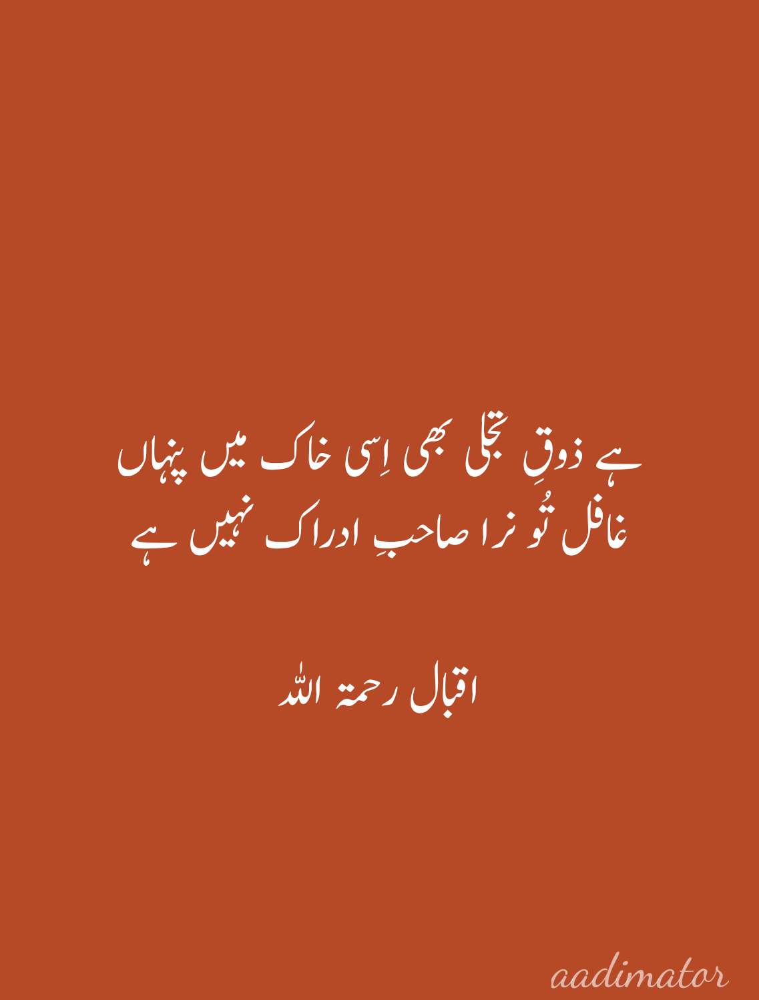
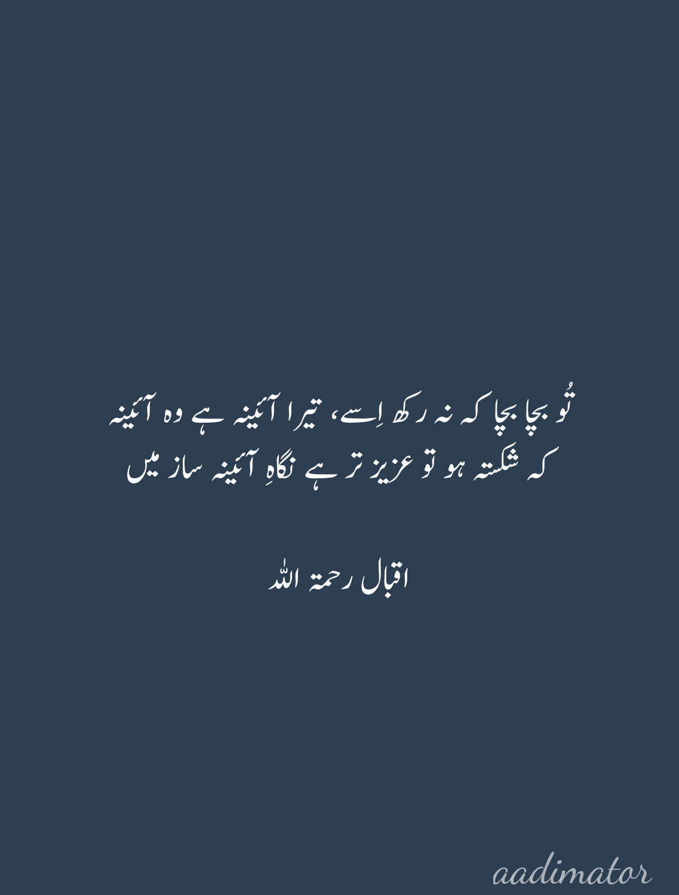

# Pak Text

A simple app to quickly create beautiful images from urdu text. 
This was inspired by the WhatsApp status update so, instead of 
adding extra features and gimmicks, I focused on the simplicity
and minimalism so the User is able to quickly type the text in
urdu, using whatever keyboard available on his device, and 
save it as beautifully rendered image.

Here's a screenshot of the App where the user can type his text
and change it's font size, background color and orientation and 
save it when he's done.

Here are some sample images generated by this:

 Sample | Images
------- | ------
 | 
 | 

